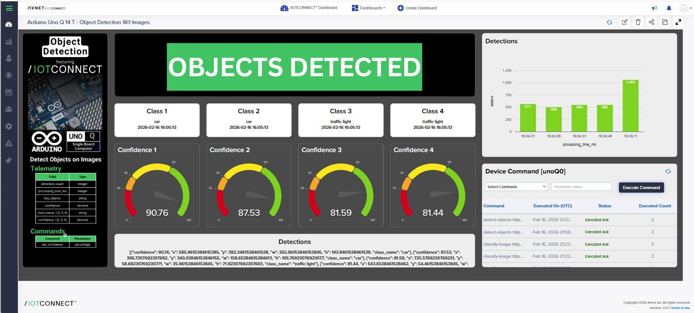

# IoTConnect-Enabled: object-detection

This is the /IOTCONNECT-enabled version of the Arduino example.

Original Arduino README:
- https://github.com/arduino/app-bricks-examples/blob/main/examples/object-detection/README.md

## Overview
This version adds an /IOTCONNECT relay client, a device template, and optional command handling so the app can publish telemetry and receive commands from /IOTCONNECT.

## What this Adds
- /IOTCONNECT relay client wiring
- Device template for telemetry + commands
- Optional commands (if defined below)
- Optional debug logs for telemetry send

App Lab folder: `/home/arduino/ArduinoApps/detect-objects-on-images`

## Files
- `python/main.py` (/IOTCONNECT-enabled app code)
- `config.json` (telemetry/command definitions)

## Device Template
This app uses the shared device template at `app-configs/arduino-app-lab-template.json`.
- Template code: `arduino`
- Template name: `arduino`

## /IOTCONNECT Dynamic Dashboard



Dashboard template file: [obj-det-dashboard-template.json](obj-det-dashboard-template.json)

Import into /IOTCONNECT:
1. Open /IOTCONNECT and go to **Dashboard**.
2. Click **Import Dashboard** and upload the JSON file linked above.
3. Save the imported dashboard and map it to the correct device/template.
4. Open the dashboard in live mode and verify widgets populate from telemetry.

## Telemetry Fields
| Field | Type |
| --- | --- |
| `UnoQdemo` | `STRING` |
| `detection_count` | `INTEGER` |
| `processing_time_ms` | `INTEGER` |
| `has_objects` | `STRING` |
| `confidence` | `DECIMAL` |
| `max_confidence` | `DECIMAL` |
| `avg_confidence` | `DECIMAL` |
| `detections_json` | `STRING` |
| `input_type` | `STRING` |
| `status` | `STRING` |
| `class_name_1` | `STRING` |
| `confidence_1` | `DECIMAL` |
| `class_name_2` | `STRING` |
| `confidence_2` | `DECIMAL` |
| `class_name_3` | `STRING` |
| `confidence_3` | `DECIMAL` |
| `class_name_4` | `STRING` |
| `confidence_4` | `DECIMAL` |

## Commands
| Command | Parameters |
| --- | --- |
| `set-confidence` | `confidence` |
| `detect-objects` | `image_url`, `image`, `image_type`, `confidence` |

## Example /IOTCONNECT command payload
```json
{
  "image_url": "https://example.com/sample.jpg",
  "image_type": "jpeg",
  "confidence": 0.25
}
```

## How to use in App Lab
1) Copy the example into your App Lab workspace.
2) Copy the /IOTCONNECT-enabled python files into the app:
   ```bash
   cp /home/arduino/iotc-arduino-uno-q-workshop/app-configs/object-detection/python/* /home/arduino/ArduinoApps/detect-objects-on-images/python/

   cp /opt/demo/iotc_relay_client.py /home/arduino/ArduinoApps/detect-objects-on-images/python/
   ```
3) Run the app and verify telemetry in /IOTCONNECT.

## Notes
- If the example sends telemetry only on user action, you will not see data until that action occurs.
- If you change the device template in /IOTCONNECT, re-create the device or update it to match these fields.


