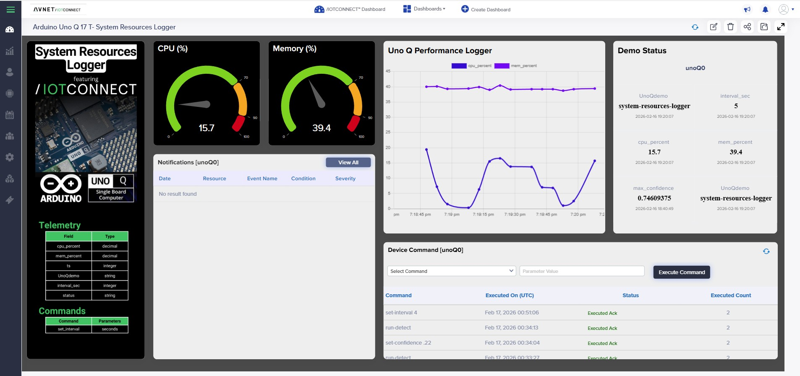

# IoTConnect-Enabled: system-resources-logger

This is the /IOTCONNECT-enabled version of the Arduino example.

Original Arduino README:
- https://github.com/arduino/app-bricks-examples/blob/main/examples/system-resources-logger/README.md

## Overview
This version adds an /IOTCONNECT relay client, a device template, and optional command handling so the app can publish telemetry and receive commands from /IOTCONNECT.

## What This Adds
- /IOTCONNECT relay client wiring
- Device template for telemetry + commands
- Optional commands (if defined below)
- Optional debug logs for telemetry send

App Lab folder: `/home/arduino/ArduinoApps/<APP_LAB_FOLDER>`

## Files
- `python/main.py` (/IOTCONNECT-enabled app code)
- `config.json` (telemetry/command definitions)

## Device Template
This app uses the shared device template at `app-configs/arduino-app-lab-template.json`.
- Template code: `arduino`
- Template name: `arduino`

## /IOTCONNECT Dynamic Dashboard



Dashboard template file: [logger-dashboard-template.json](logger-dashboard-template.json)

Import into /IOTCONNECT:
1. Open /IOTCONNECT and go to **Dashboard**.
2. Click **Import Dashboard** and upload the JSON file linked above.
3. Save the imported dashboard and map it to the correct device/template.
4. Open the dashboard in live mode and verify widgets populate from telemetry.

## Telemetry Fields
| Field | Type |
| --- | --- |
| `UnoQdemo` | `STRING` |
| `interval_sec` | `INTEGER` |
| `cpu_percent` | `DECIMAL` |
| `mem_percent` | `DECIMAL` |
| `ts` | `INTEGER` |
| `status` | `STRING` |

## Commands
| Command | Parameters |
| --- | --- |
| `set-interval` | `seconds` |

## How to Use in App Lab
1) Copy the example into your App Lab workspace.
2) Copy the /IOTCONNECT-enabled python files into the app:
   ```bash
   cp /home/arduino/iotc-arduino-uno-q-workshop/app-configs/system-resources-logger/python/* /home/arduino/ArduinoApps/<APP_LAB_FOLDER>/python/
   cp /opt/demo/iotc_relay_client.py /home/arduino/ArduinoApps/<APP_LAB_FOLDER>/python/
   ```
3) Run the app and verify telemetry in /IOTCONNECT.

## Notes
- If the example sends telemetry only on user action, you will not see data until that action occurs.
- If you change the device template in /IOTCONNECT, re-create the device or update it to match these fields.


