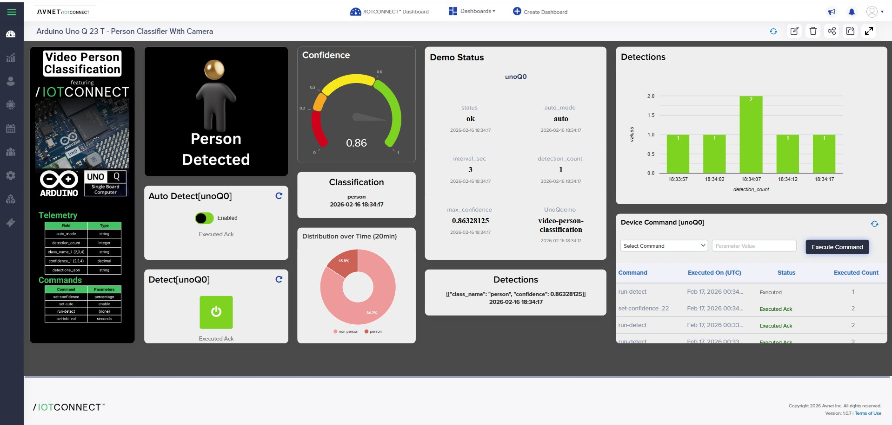

# /IOTCONNECT-Enabled: video-person-classification

This is the /IOTCONNECT-enabled version of the Arduino example.

Original Arduino README:
- https://github.com/arduino/app-bricks-examples/blob/main/examples/video-person-classification/README.md

## Overview
This version adds an /IOTCONNECT relay client, a device template, and optional command handling so the app can publish telemetry and receive commands from /IOTCONNECT.

## What This Adds
- /IOTCONNECT relay client wiring
- Device template for telemetry + commands
- Optional commands (if defined below)
- Optional debug logs for telemetry send

App Lab folder: `/home/arduino/ArduinoApps/<APP_LAB_FOLDER>`

## Files
- `python/main.py` (/IOTCONNECT-enabled app code)
- `config.json` (telemetry/command definitions)

## Additional Hardware Required

This app requires a USB camera and a powered USB hub (since the Arduino Uno Q has a single USB-C port used for power).

**USB Camera Recommendations:**
- [Logitech Brio 101](https://www.amazon.com/dp/B085TFF7M1?ref_=ppx_hzsearch_conn_dt_b_fed_asin_title_14&th=1)
- [Logitech Brio 101 (alternate listing)](https://www.amazon.com/Logitech-Webcam-Meetings-Streaming-Built/dp/B0BXGFFSL1)
- [Logitech Brio 300](https://www.amazon.com/Logitech-Reduction-Microphone-ceritified-Correction/dp/B09RGJWVG7/ref=sr_1_1?crid=1XGN6Z1TUMVER&dib=eyJ2IjoiMSJ9.b3jaFFykcIf7kAnwccsMPHXCrukugU3u-uQ8p41y2Cu-Xv0MJUA4oqvKkMbPzMhOPd2povyLUViBRE62Pz5-MPpEYLxILzpFZnJr6DA1FG2hcHIEO0YNDEcwsGDq909_Fle4j_EGkZhlpLKyFrCyaN0iIoPGotyuJDwcoB7MIp8qOsxfgAzR5-cAKTcxEtEQgfdnHZbwGfsxEd2k86d5SYiHnrQZ_u8yrndqAQh8aC4fswkQoi8t8rtHdLtsJJljKdErkEa1QhOgIz4ZxOHdmaNwM45Zdtpf-GLdKgpxi3k.RJZSn1oXn6BYwPdwWlTF_Yd1BlSOF35BmkjcwDWhJmc&dib_tag=se&keywords=logitech+brio+300&qid=1771353155&s=electronics&sprefix=logitech+brio+300%2Celectronics%2C165&sr=1-1)

**Powered USB Hub Recommendations:**
- [Sabrent 4-Port USB Hub](https://www.amazon.com/dp/B07H2ZS1B5?ref=cm_sw_r_cp_ud_dp_700AHY8JWV8DF6AR7V2Q&ref_=cm_sw_r_cp_ud_dp_700AHY8JWV8DF6AR7V2Q&social_share=cm_sw_r_cp_ud_dp_700AHY8JWV8DF6AR7V2Q&th=1)

> [!NOTE]
> Most USB cameras should work, but the models above have been tested and verified.

> [!IMPORTANT]
> When using a powered USB hub, Arduino App Lab will no longer recognize the board via USB. You will need to connect to the board using the **Network** option instead.

## Device Template
This app uses the shared device template at `app-configs/arduino-app-lab-template.json`.
- Template code: `arduino`
- Template name: `arduino`

## /IOTCONNECT Dynamic Dashboard



Dashboard template file: [unoQ-personClass_dashboard_template.json](unoQ-personClass_dashboard_template.json)

Import into /IOTCONNECT:
1. Open /IOTCONNECT and go to **Dashboard**.
2. Click **Import Dashboard** and upload the JSON file linked above.
3. Save the imported dashboard and map it to the correct device/template.
4. Open the dashboard in live mode and verify widgets populate from telemetry.

## Telemetry Fields
| Field | Type |
| --- | --- |
| `UnoQdemo` | `STRING` |
| `auto_mode` | `STRING` |
| `interval_sec` | `INTEGER` |
| `detection_count` | `INTEGER` |
| `max_confidence` | `DECIMAL` |
| `avg_confidence` | `DECIMAL` |
| `detections_json` | `STRING` |
| `status` | `STRING` |
| `class_name_1` | `STRING` |
| `confidence_1` | `DECIMAL` |
| `class_name_2` | `STRING` |
| `confidence_2` | `DECIMAL` |
| `class_name_3` | `STRING` |
| `confidence_3` | `DECIMAL` |
| `class_name_4` | `STRING` |
| `confidence_4` | `DECIMAL` |

## Commands
| Command | Parameters |
| --- | --- |
| `set-interval` | `seconds` |
| `set-confidence` | `confidence` |
| `set-auto` | `enabled` |
| `run-detect` | `(none)` |

## How to Use in App Lab
1) Copy the example into your App Lab workspace.
2) Copy the /IOTCONNECT-enabled python files into the app:
   ```bash
   cp /home/arduino/iotc-arduino-uno-q-workshop/app-configs/video-person-classification/python/* /home/arduino/ArduinoApps/<APP_LAB_FOLDER>/python/

   cp /opt/demo/iotc_relay_client.py /home/arduino/ArduinoApps/<APP_LAB_FOLDER>/python/
   ```
3) Run the app and verify telemetry in /IOTCONNECT.

## Notes
- If the example sends telemetry only on user action, you will not see data until that action occurs.
- If you change the device template in /IOTCONNECT, re-create the device or update it to match these fields.


